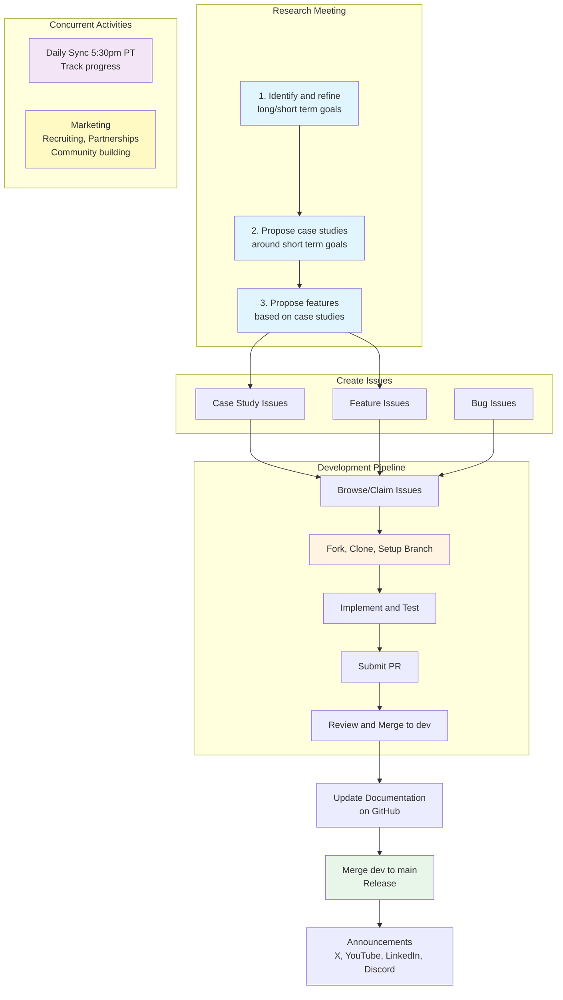

# MassGen Contributor Handbook

Multi-Agent Scaling System for GenAI

Version 0.1.8 | Last Updated: November 2025

---

## Welcome to MassGen

Thank you for your interest in contributing to MassGen. This handbook is your comprehensive guide to understanding the project, finding your place in the community, and making meaningful contributions.

Whether you are a researcher with ideas, a developer who loves to code, a writer who can document, or a marketer who builds communities, there is a place for you here.

---

## MassGen team Workflow

The following diagram illustrates  MassGen team workflow.

---

## Communication and Collaboration

### Daily Sync Meetings

**When:** 5:30pm PST, every day

**Purpose:**
- Share progress updates from each track owner
- Coordinate across all tracks (research, dev, docs, marketing)
- Identify and address blockers
- Align on priorities for the next day

### Research Meetings

**When:** 6:00pm PST, XXX

**Purpose:**
- indentify and refine long and short term goals
- propose concrete case studies to achieve short term goals
- generate features need to be developed

---

## Getting Started 

1. **Join Discord** - Connect with the community at [discord.gg/VVrT2rQaz5](https://discord.gg/VVrT2rQaz5)
2. **Introduce Yourself** - Post in the #massgen channel and let us know your interests
3. **Join the meeting** - Request meeting link in #massgen channel and attend your first meeting as an observer

---

## Ready to contribute?

4. **Choose Your Track** - Select from Research, Case Studies, Marketing, or Development
5. **Contact Track Owner** - Reach out to the appropriate track owner listed at bottom
6. **Start Contributing** - Follow the specific guide for your chosen track

---

## Four Contribution Tracks

MassGen welcomes contributions across four distinct tracks. Each track has its own workflow, contacts, and contribution style. Pick the one that matches your skills and interests.

| Track | What You Do | Contact (Discord) |
|-------|-------------|-------------------|
| **Research** | Propose features at research meetings | jeffreycho |
| **Case Studies** | Document real-world usage examples | sealover8336 |
| **Marketing** | Social media, content, partnerships | justin_zhang |
| **Development** | Code, tests, docs, bug fixes | nickcrispino, danrui2020 |
| **Documents** | Update documentation before releases | TBD |
| **Announcement** | Share releases on social media | TBD |
| **Onboarding** | Help new people become contributors | TBD |

For detailed contact information, communication channels, and response times, see the [Contact Directory](resources#contact-directory)

**Full Team Directory:** See the [Team Spreadsheet](https://docs.google.com/spreadsheets/d/1pNmMOdEmqb6TKOPjhk3NBPJWCWMvTTDaq1FufLfL3j4/edit?gid=0#gid=0)

---

